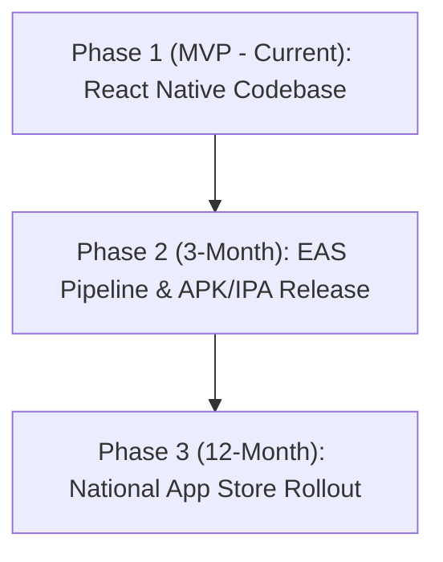

# SentinelX V7 Ultimate — Mobile Application Future Scope

This document details the implementation architecture, current status, compilation constraints, and rollout roadmap for the **SentinelX Citizen Shield Mobile Application**.

---

## 📱 Mobile App Architecture & Current Status

The SentinelX ecosystem includes a dedicated mobile app designed for digital public safety:

* **Location in Workspace:** [apps/citizen-mobile](file:///e:/Meet/Meet/Hackathon/SentinelX/apps/citizen-mobile)
* **Framework:** React Native + Expo + TypeScript
* **Current MVP Scope:** The application codebase is fully scaffolded, representing the screen navigation flow, local linguistic scam verification modules, dialer interception stub hooks, and translations.

---

## 🛠️ Binary Compilation Constraints (.APK / .IPA)

There are no pre-compiled `.apk` (Android) or `.ipa` (iOS) binaries checked into the repository because:

1. **Compilation Environment:** React Native and Expo require native platform SDKs (Android SDK/Gradle for Android, and macOS Xcode/Cocoapods for iOS) to build executable packages.
2. **Distribution Pipelines:** Modern React Native apps are distributed using Expo Application Services (EAS Build) or secure testing environments (TestFlight, Google Play Console Internal Sharing) rather than raw binary binaries in git, to ensure compatibility, signing authority, and device security.

---

## 🚀 Mobile App Rollout Roadmap

We have structured the native application rollout into three logical phases matching the project's master roadmap:



### Phase 1: Hackathon MVP (Current)
* **Codebase Availability:** Expo React Native source files.
* **Functionality:** UI screens showing scam checks, translation, and threat logs.
* **Testing:** Run locally using Expo Go client:
  ```bash
  cd apps/citizen-mobile
  npm install
  npx expo start
  ```

### Phase 2: Near-Term Expansion (3-Month Rollout)
* **EAS Build Setup:** Establish automated cloud builds using `eas-cli`.
* **Testing Distribution:** Release signed `.apk` and iOS TestFlight builds for pilot testing.
* **Native Call Interceptor Bindings:** Bind native Android Broadcast Receivers (`PhoneStateListener`) and iOS CallKit extensions to block spoofed CLI streams.

### Phase 3: Production Platform (12-Month Rollout)
* **Store Releases:** Official publishing to Apple App Store and Google Play Store.
* **National Registry Link:** Direct integration with carrier databases (Airtel, Jio, Vi) and security bureaus for live interception.
