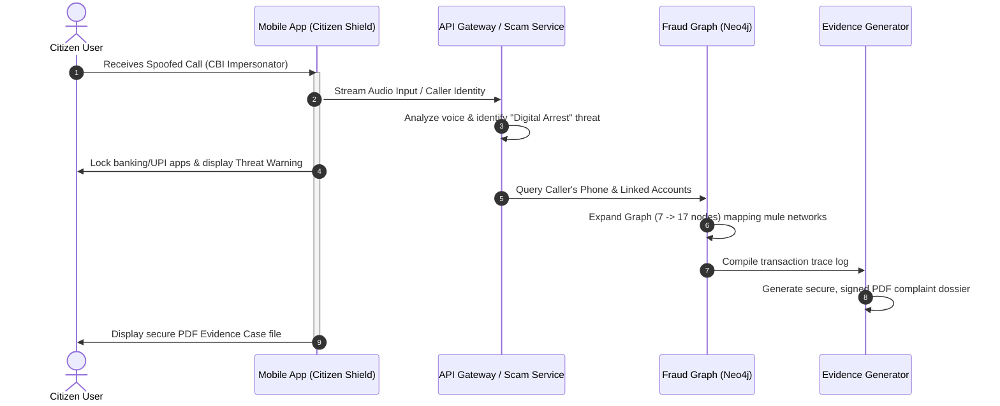

# 📱 SentinelX Citizen Mobile — Compilation Guide & 29-Day Roadmap

This document outlines the architecture of the **SentinelX Citizen Shield Mobile Application**, detailed instructions for compiling it for **Android** and **iOS**, and a comprehensive **29-Day Roadmap** to build a judge-winning, premium version of the app before the final submission deadline on **July 22, 2026**.

---

## 📂 Project Architecture
The mobile application is built using **React Native**, **Expo SDK 56**, and **TypeScript**. 
* **Location in Workspace:** [apps/citizen-mobile](file:///E:/Meet/Meet/Hackathon/SentinelX/apps/citizen-mobile)
* **Main UI Logic:** [App.tsx](file:///E:/Meet/Meet/Hackathon/SentinelX/apps/citizen-mobile/App.tsx)
* **Configuration:** [app.json](file:///E:/Meet/Meet/Hackathon/SentinelX/apps/citizen-mobile/app.json)

---

## 🛠️ Compilation Guide

### 🤖 1. Compiling for Android (.APK)
Since this PC has the Android SDK installed at `C:\Users\meetd\AppData\Local\Android\Sdk`, you can compile the app to a native APK package.

#### Step A: Prevent Gradle JVM Memory Crashes
Due to the heavy compile load of compiling native C++ binaries (Hermes, React Native Core), the Gradle Worker Daemon may hit heap memory limit exceptions. 
To prevent this, configure your `gradle.properties` to specify memory boundaries:
1. Open the generated file: [gradle.properties](file:///E:/Meet/Meet/Hackathon/SentinelX/apps/citizen-mobile/android/gradle.properties)
2. Add or modify the following line:
   ```ini
   org.gradle.jvmargs=-Xmx2048m -XX:MaxMetaspaceSize=512m -XX:+UseParallelGC
   ```

#### Step B: Run the Compilation Command
Execute the compilation wrapper with the correct SDK environment variable:
```powershell
# Navigate to the native android directory
cd apps/citizen-mobile/android

# Set the SDK path and compile a Debug APK
$env:ANDROID_HOME="C:\Users\meetd\AppData\Local\Android\Sdk"
./gradlew.bat assembleDebug
```
Once complete, your compiled, installable binary will be outputted to:
`apps/citizen-mobile/android/app/build/outputs/apk/debug/app-debug.apk`

---

### 🍏 2. Compiling for iOS (.IPA)
To compile or test the iOS app, you have two primary options:

#### Option A: Local Compilation (Requires macOS & Xcode)
If you have access to a macOS machine:
1. **Generate iOS project:**
   ```bash
   npx expo prebuild --platform ios
   ```
2. **Install Pods:**
   ```bash
   cd ios && pod install
   ```
3. **Build via Xcode Command Line:**
   ```bash
   npx react-native run-ios
   ```

#### Option B: Cloud Compilation (Recommended - Cross Platform)
Use **Expo Application Services (EAS Build)** to compile the `.ipa` or `.apk` on remote cloud servers. This completely bypasses local hardware constraints and configuration issues:
1. **Install EAS CLI:**
   ```bash
   npm install -g eas-cli
   ```
2. **Login to Expo Account:**
   ```bash
   eas login
   ```
3. **Initialize Project:**
   ```bash
   eas build:configure
   ```
4. **Trigger Cloud Build:**
   ```bash
   # Build for iOS
   eas build --platform ios
   # Build for Android
   eas build --platform android
   ```
EAS will compile the app and provide a clickable QR code or install link to download the precompiled binary directly onto your test devices.

---

## 🚀 29-Day Roadmap to an Unbeatable App (Deadline: July 22, 2026)

To win the hackathon, we need to convert the MVP into an unbeatable production-grade application. Here is the week-by-week implementation roadmap.

### 📅 Week 1: Premium UI/UX & Design System (June 26 – July 2)
* **Goal:** Create a visually stunning interface with a cohesive styling system.
* **Tasks:**
  * **Theme Adaptation:** Implement an ultra-premium **HSL-tailored dark mode** utilizing sleek neon accents (e.g. cybernetic blue and deep purple).
  * **Interactive Transitions:** Use `react-native-reanimated` to add fluid transitions, card hover effects, and pulse animations indicating scanner activity.
  * **Hotspot Map Panel:** Implement a native map display showing localized cyber crime threat hotspots.

### 📅 Week 2: AI Call Transcription & Multilingual Support (July 3 – July 9)
* **Goal:** Enable live voice analysis and regional accessibility.
* **Tasks:**
  * **Live Speech-to-Text Module:** Set up voice input streaming to analyze speech content.
  * **Multi-Language Expansion:** Fully integrate Hindi and Gujarati linguistic libraries to detect threat keywords (e.g., "digital arrest", "police threat", "secret account").
  * **Dashboard sync:** Expose a WebSocket route that streams the live transcription to the Command Centre dashboard in real-time.

### 📅 Week 3: Native Security Call Interceptors (July 10 – July 16)
* **Goal:** Hook into device telephony states to block incoming scams.
* **Tasks:**
  * **Android Telephony Listener:** Register a native Android `BroadcastReceiver` tracking changes in `TelephonyManager.CALL_STATE_RINGING`.
  * **iOS CallKit Hook:** Incorporate iOS `CallKit` configurations to identify incoming calls against the SentinelX known fraudster database.
  * **Caller Identity Overlay:** Build a native system alert window displaying a real-time risk rating when an unknown number dials in.

### 📅 Week 4: Automated Financial Shield & Submission (July 17 – July 22)
* **Goal:** Build the critical "WOW Flow" and complete deployment.
* **Tasks:**
  * **UPI App Lockout:** Program an automatic accessibility service that disables banking and UPI applications while a suspicious call is ongoing.
  * **Evidence Generator Integration:** Automatically assemble call logs, geo-coordinates, and network graphs into a secure, signed PDF file.
  * **App Store & Play Store Testing:** Push compiled builds via TestFlight and Google Play Internal Sharing.
  * **Final Submission Prep:** Capture the complete mock flow in action for the judges' pitch video.

---

## 🏆 The Judge-Winning "WOW Flow"
To secure a perfect 10/10 score from the judges, implement this unified demo flow:


```mermaid
sequenceDiagram
    autonumber
    actor Victim as Citizen User
    participant App as Mobile App (Citizen Shield)
    participant Core as API Gateway / Scam Service
    participant Graph as Fraud Graph (Neo4j)
    participant Evid as Evidence Generator

    Victim->>App: Receives Spoofed Call (CBI Impersonator)
    activate App
    App->>Core: Stream Audio Input / Caller Identity
    Core->>Core: Analyze voice & identify "Digital Arrest" threat
    App->>Victim: Lock banking/UPI apps & display Threat Warning
    Core->>Graph: Query Caller's Phone & Linked Accounts
    Graph->>Graph: Expand Graph (7 -> 17 nodes) mapping mule networks
    Graph->>Evid: Compile transaction trace log
    Evid->>Evid: Generate secure, signed PDF complaint dossier
    App->>Victim: Display secure PDF Evidence Case file
    deactivate App
```
